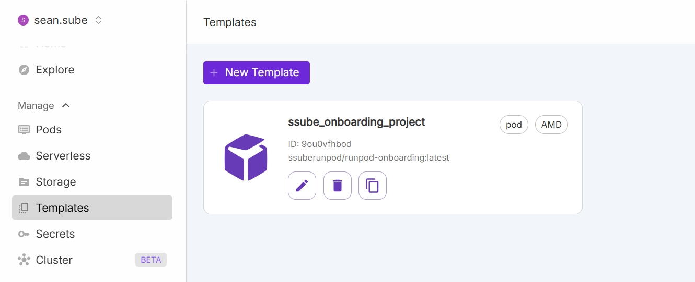
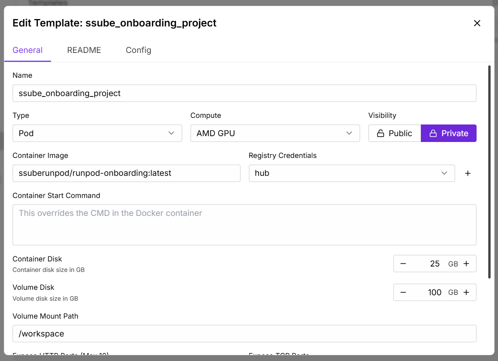
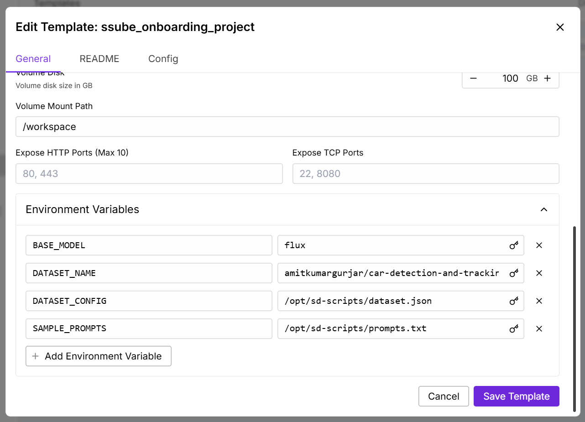
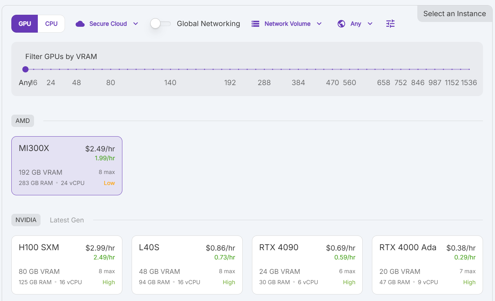
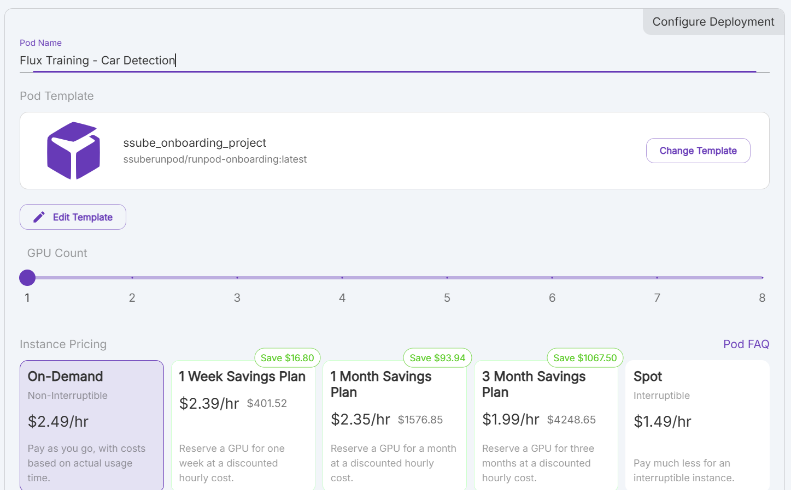
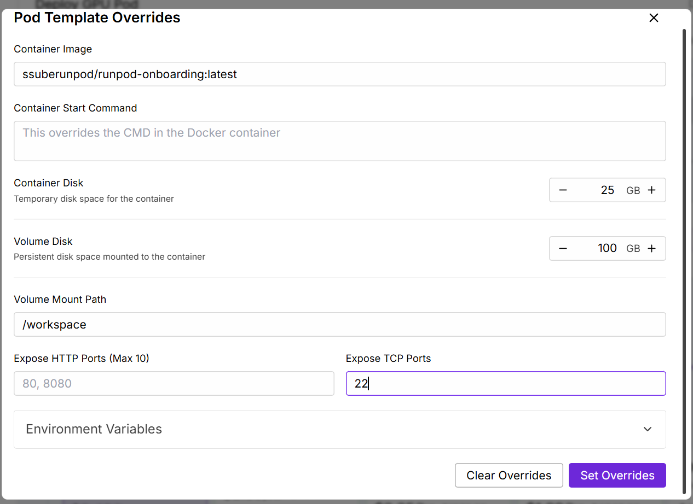

# Training Flux.1 Dev on the MI300X GPU with Huge Batch Sizes

For this post I'm going to be experimenting with fine-tuning Flux.1 Dev on the world's largest GPU, the AMD MI300X. At
192GB of VRAM per GPU, the MI300X allows training at batch sizes and resolutions that no other GPU currently supports.

The Flux.1 models were released in August 2024 and quickly gained popularity for their image quality and ability to
follow complex prompts. The Dev model is the largest of the Flux.1 models that can be self-hosted with 12 billion
parameters, and one of the highest-quality image models that is currently available for training and fine-tuning.

In this post, I will walk you through the process of setting up a training environment in a Docker container and
training Flux LoRAs on RunPod's MI300X GPUs. We will use the `kohya-ss/sd-scripts` repository to train the model,
although this container should be compatible with any training scripts that use PyTorch, if you prefer to use a
different training script.

### Batch Size, Epochs, & Steps

While training Flux with larger batch sizes, you will need to adjust the number of epochs
in order to reach the desired number of steps. Put simply, increasing the batch size does
not increase the amount of data that the model will learn on each step, but it does help
increase the generalization of that data and make the model more flexible.

While testing this container and post, I trained Flux.1 Dev in FP8 base mode with a dataset
made up of 400 images. The training resolution was set to a target of 1024 with buckets every
128 pixels. All 400 images were resized and placed in the 1280x768 bucket for training.

During training, I measured the peak VRAM usage at various batch sizes to find the largest
batch size supported by a single MI300X, which is about 60 images per batch.

| Batch Size | Peak VRAM | Steps per Epoch |
| --- | ----- | --- |
|   4 |  27GB | 100 |
|   8 |  39GB | 50 |
|  16 |  63GB | 25 |
|  32 | 112GB | 13 |
|  48 | 162GB | 9 |
|  56 | 186GB | 8 |
|  60 | 196GB | 7 |

## Prerequisites

To run this yourself, you will need:

1. a RunPod account
2. a text editor
3. one of:
    1. a local installation of Docker and a Docker Hub account
    2. OR Github actions and a Github account

You do not need to run anything locally to complete this tutorial, but if you have a fast network connection, it may be
easier to build the Docker container on a local machine with plenty of free disk space.

Pushing the image up to GHCR or Docker Hub may be faster from Github Actions, but you will need to remove some unused
dependencies and build tools in order to free up enough disk space to build the container. The total size of the
container is about 100GB after it has been built, so make sure you have at least 120GB of free space on your build
machine.

If you have limited bandwidth or a slow network connection, I recommend using Github Actions, since the Flux models can
be pretty large.

## Container

To begin, we need to build a Docker container that contains all of the dependencies required for training Flux. This
will include a ROCm-compatible PyTorch installation, the Flux.1 Dev model, and the `kohya-ss/sd-scripts` repository for
training.

There are a few additional scripts that we will be adding to the container to make training easier, which I will explain
in more detail later in the post.

In order to build the training container, the Dockerfile will do a few different things:

1. Start with the `rocm/pytorch` base image
2. Download the Flux.1 models from Cloudflare
3. Install the `kohya-ss/sd-scripts` repo for training
4. Fix a few conflicting dependencies (`boto3` and `botocore` versions)
5. Copy the training scripts to be run

Omitted from the container are the training dataset and the hyperparameters, which will be configured at runtime using
environment variables.

### Base Container

Building PyTorch can be very time-consuming and prone to version conflicts with the GPU drivers. To help avoid those
issues, we will be using the `rocm/pytorch` base image from Docker Hub.

This base image is quite large, but it contains a working and ready-to-use PyTorch installation that is compatible with
ROCm. Recent versions of the image are compatible with the MI300X GPUs that are available on RunPod.

**Note**: It is important to make sure you do not install a different version of PyTorch during the later steps, since
that will usually install the CUDA version of PyTorch, which is not compatible with the AMD GPUs that we will be using.

### Flux Model

I am downloading the Flux.1 Dev model from a Cloudflare mirror, but you can download Flux from
HuggingFace or another source as long as they follow the format required by the `kohya-ss/sd-scripts` repository,
with the CLIP-L and T5XXL encoders separated into their own `.safetensors` files.

In total, the Flux models consume about 32GB of disk space. These are the largest layers that we will be adding to the
container and it may take a while to download everything.

```shell
/workspace$ ls -lha flux
total 32G
drwxrwxr-x  2 ssube ssube 4.0K Oct  4 02:10 .
drwxrwxr-x 10 ssube ssube 4.0K Feb  1 02:50 ..
-rw-rw-r--  1 ssube ssube 320M Aug 17  2024 ae.safetensors
-rw-rw-r--  1 ssube ssube 235M Aug 17  2024 clip_l.safetensors
-rw-rw-r--  1 ssube ssube  23G Oct  4 02:12 flux_dev.safetensors
-rw-rw-r--  1 ssube ssube 9.2G Aug 17  2024 t5xxl_fp16.safetensors
```

### Training Scripts

To keep the training container flexible, most of the hyperparameters and configuration options
have been moved into environment variables. This makes it easy to change the training configuration
without rebuilding the container every time.

There are two scripts that are included in the container that will be used to train the Flux model:

1. `train-main.sh` - This script is the main entrypoint for training. It validates the environment variables, downloads
  the dataset, and launches the training script for the current base model (in this case, Flux.1 Dev).
2. `train-flux.sh` - This script is the actual training script that will be run by `train-main.sh`. It maps the
  environment variables to the training script's arguments and launches the training process.

### Building the Container

Once all of the prerequisites are ready, you can build the container using the following commands:

```shell
> docker build -t your-name/flux-train:latest .
> docker push your-name/flux-train:latest
```

These commands are wrapped up into the `build.sh` script in the repository for convenience.

This may take a while, especially if you are pushing the container from a slow network connection. The total size of
the container is about 100GB uncompressed, so make sure you have enough free space on your build machine to complete
the build (about 120GB should be sufficient).

## RunPod Template

Once you have built and pushed the Docker container to Docker Hub or Github Container
Registry, we will create a RunPod template to make training easier.



To create a RunPod template, you will need to have a RunPod account and be logged in.

1. Open the RunPod console and create a new template.
2. Enter a memorable name for the template, like `Flux Training`.
3. Select the `Pod` type.
4. Select `AMD GPU` for compute.
5. You can make the template public or private, depending on your needs.
6. Enter the container image that you pushed to Docker Hub or GHCR, like `your-name/flux-train:latest`.
7. Configure the registry credentials if you are using a private container image or a private registry.
8. Set the container disk size to 25GB, we will not be using much local storage.
9. Set the volume disk size to 100GB to ensure you have enough space for dataset and output.
10. Set the following environment variables:
    1. `BASE_MODEL=flux`
    2. `DATASET_NAME=your-dataset-name` (for example, `DATASET_NAME=amitkumargurjar/car-detection-and-tracking-dataset`)
    3. `DATASET_CONFIG=/opt/sd-scripts/dataset.json`
    4. `SAMPLE_PROMPTS=/opt/sd-scripts/prompts.txt`

Other options can be left at their defaults, but you may want to configure more of the environment variables
depending on your training needs.



### Environment Variables

There are a number of hyperparameters that you can configure using environment variables. All of them have reasonable
defaults, but you can adjust them for each pod and training run until you find the best settings for your dataset.

Some of the available environment variables include:

- `PARAMS_D_COEF`
  - similar to the learning rate, for the Prodigy optimizer
- `PARAMS_LEARNING_RATE`
  - general learning rate, should be left at `1` when using the Prodigy optimizer
- `PARAMS_LEARNING_SCHEDULER`
  - learning rate scheduler, `cosine` usually works well with the Prodigy optimizer
- `PARAMS_MAX_EPOCHS`
  - the number of epochs to train for. One epoch is one pass through the dataset.
  - this should be set based on the size of your dataset and the batch size, with
    a target of at least 1000 training steps.
- `PARAMS_NETWORK_ALPHA`
  - this is similar to a strength parameter for the output LoRA
- `PARAMS_NETWORK_DIM`
  - the size of the output LoRA
  - values between 4-128 generally work well, with 8 or 32 being my personal favorites
- `PARAMS_NOISE_OFFSET`
  - adds additional noise during training to help the model generalize better
- `PARAMS_NUM_CYCLES`
  - number of cycles for the learning rate scheduler (only applicable to `cosine` and other cyclic schedulers)
- `PARAMS_OPTIMIZER_ARGS`
  - additional arguments for the optimizer, rarely needed
- `PARAMS_OPTIMIZER_TYPE`
  - the optimizer to use, `prodigy` is the default and recommended for easier training
- `PARAMS_RESUME_FROM`
  - if you are resuming a previous training run, you can specify the checkpoint here
- `PARAMS_SAVE_EVERY_N_STEPS`
  - how often to save a checkpoint, in training steps
  - I prefer to set this to the number of steps per epoch or a multiple of that, if you want to save more often
  - saving is much faster than generating samples, so you can save more often without impacting training speed
- `PARAMS_SAMPLE_EVERY_N_STEPS`
  - how often to generate samples, in training steps
  - I prefer to set this based on the total number of training steps, so that I get about 10 samples per training run
  - generating samples will interrupt training for a few minutes, so you don't want to do it too often
- `PARAMS_SPLIT_QKV`
  - split up the QKV layers while training, which can help the model capture more details
- `PARAMS_WEIGHT_DECAY`
  - helps to reduce overfitting by enouraging smaller changes

A few other parameters are configured through the `dataset.json` file, such as batch size and the number of repeats for
each dataset. Changing those parameters will require you to rebuild the container.



## Training

Once you have created a RunPod template, you need to deploy a new pod using that template.

1. From the Pods page in the RunPod console, click the `Deploy` button and select the template that you created earlier.
2. Give the pod a memorable name, like `Flux Training - Car Detection`.
3. Select the number of GPUs to use, 1 is sufficient for this example since the MI300X has so much VRAM.
4. Choose your pricing category.
   1. You can use the `On-Demand` category for short training runs.
   2. For longer training runs, you may want to use a Savings Plan to reduce the cost.
   3. If you are willing to let your training run be interrupted, you can use the `Spot` category to save even more.
5. Click the `Deploy` button to start the pod.





**Note**: If you are going to use SSH or rsync to download the results, you will need to configure the pod to allow SSH
access. Make sure you have added your public SSH key to the RunPod console, then add port 22 to the `Expose TCP Ports`
section of the pod configuration. This will limit the number of datacenters where your pod can be deployed, but it will
allow you to download the results more easily.



It will take a little while for the container image to be downloaded and extracted, but once that has occurred, the
training scripts will download your dataset and automatically start training.

If you want to change any of the training parameters, you can do so by editing the pod configuration and restarting the
pod. The training scripts will automatically pick up the new environment variables and restart the training process.

Give the training run a few minutes to get started and wait for the progress bar to stabilize. Once the logs are showing
a consistent ETA, you can set yourself a reminder to check back in a few hours to see how the training is going. While
you are waiting, you can check the logs in the RunPod console to make that the training is running smoothly and has not
encountered any errors, or go for a nice walk and enjoy the fresh air.

### Downloading Results

With the default settings for the `OUTPUT_PATH` environment variable, the training logs and checkpoints will be saved to
the `/workspace/output` directory in the pod. You can use our `runpodctl` tool to transfer files to and from your pods,
or you can download the logs and checkpoints using a file transfer tool or backup tool (like `rsync` or `SyncThing`).

Please see https://docs.runpod.io/pods/storage/transfer-files for more details on how to transfer files to and from your
pods.

If you are using `runpodctl` to download the results, you will need to run the `runpodctl send` command from within the pod and pass the output filename of your model to the command:

```shell
> runpodctl send /workspace/output/7318cd4a8c75-1740076123.safetensors

Sending '7318cd4a8c75-1740076123.safetensors' (75.7 MB)
Code is: 1234-some-random-words
On the other computer run

runpodctl receive 1234-some-random-words
```

Then on your local machine, you can run the following command to download the results:

```shell
> runpodctl receive 1234-some-random-words
```

### Image Testing

Once the training has completed, you can test the model by generating some images in your favorite AI image generation
tool. The LoRAs produced by `kohya-ss/sd-scripts` are compatible with most of the popular AI art tools, including
ComfyUI and Forge.

For ComfyUI, you should copy the `.safetensors` file that you downloaded from your pod into the `models/loras` directory in your ComfyUI installation.
You should be able to find and use the LoRA through the `Load LoRA` node.

For Forge, you should copy the `.safetensors` file that you downloaded from your pod into the `models/Lora` directory in your Forge installation. You
should be able to find the LoRA in the LoRA browser, along with any other LoRAs that you have installed.

When testing the model, you should try a variety of prompts to see how the model responds. You can also try using the
checkpoints that were saved during training, because the final checkpoint may not always be the best one for your
dataset. In some cases, merging the results of multiple training runs can produce better results than using a single
training run.
